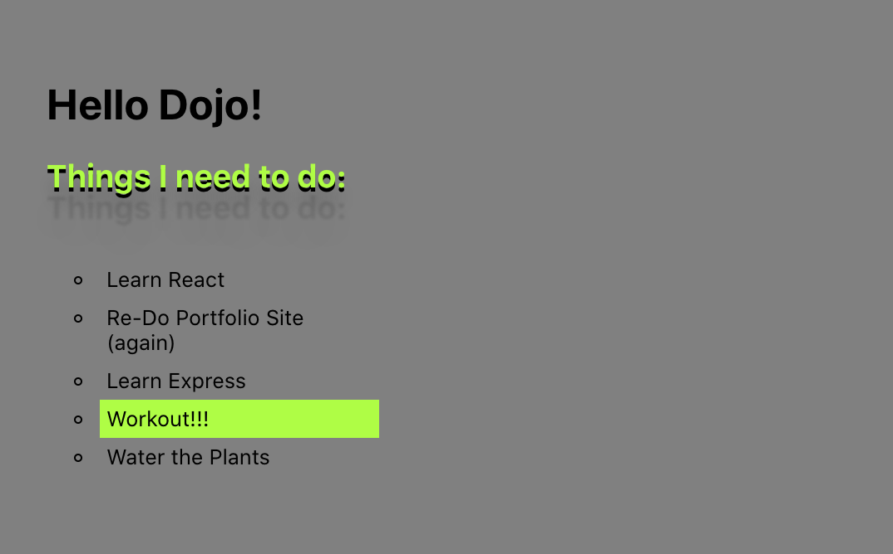

# Baby's First React App!

This assignment had 2 objectives

- Create a react app with create-react-app
- use JSX to display a header and a list

I was able to accomplish this and also play with the styling in App.css

